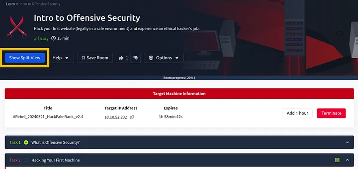
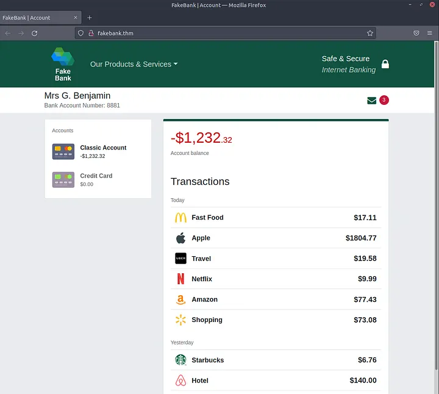

Offensive Security Intro | Walkthroughs | Difficulty = EASY | 

TASK 1 | What is Offensive Security?

What is Offensive Security?
“To outsmart a hacker, you need to think like one.”
Offensive Security is the practice of legally and ethically simulating hacking activities to discover vulnerabilities in systems. 
It involves breaking into systems, exploiting bugs, and finding loopholes — all with the goal of strengthening security.

— Answer the question below —

Question 1: Which of the following options better represents the process where you simulate a hacker’s actions to find vulnerabilities in a system ?

> Offensive Security

> Defensive Security

Answer: Offensive Security

TASK 2 | Hacking your first machine

In this room, we have prepared a fake bank application called Fakebank that you can safely hack. To start this machine, 
click on the Start Machine button below.

Start Machine

Step 1: Open the Terminal
The terminal (command line) lets users interact with the system without a GUI. Open it by clicking the Terminal icon on the right side of the screen.

Step 2: Use Gobuster to Find Hidden Pages
Gobuster scans websites for hidden admin or sensitive pages that may be publicly accessible due to misconfiguration or human error, potentially exposing critical functions or data.

'''bash
gobuster -u http://fakebank.thm -w wordlist.txt dir 
'''

