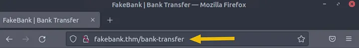
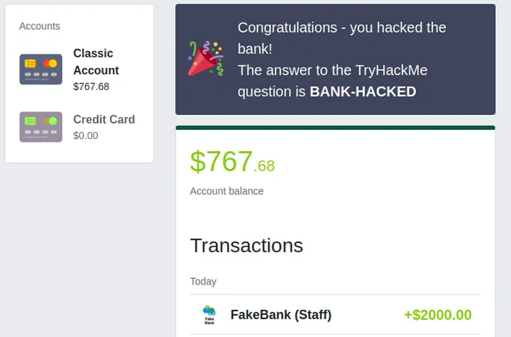
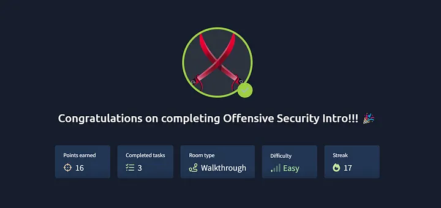

Offensive Security Intro | Walkthroughs | Difficulty = EASY | 


TASK 1 | What is Offensive Security?

What is Offensive Security?
“To outsmart a hacker, you need to think like one.”
Offensive Security is the practice of legally and ethically simulating hacking activities to discover vulnerabilities in systems. 
It involves breaking into systems, exploiting bugs, and finding loopholes — all with the goal of strengthening security.

— Answer the question below —

Q1 : Which of the following options better represents the process where you simulate a hacker’s actions to find vulnerabilities in a system ?

> Offensive Security

> Defensive Security

Answer: Offensive Security

TASK 2 | Hacking your first machine

In this room, we have prepared a fake bank application called Fakebank that you can safely hack. To start this machine, 
click on the Start Machine button below.

Start Machine


Step 1: Open the Terminal
The terminal (command line) lets users interact with the system without a GUI. Open it by clicking the Terminal icon on the right side of the screen.


Step 2: Use Gobuster to Find Hidden Pages
Gobuster scans websites for hidden admin or sensitive pages that may be publicly accessible due to misconfiguration or human error, potentially exposing critical functions or data.

```bash
gobuster -u http://fakebank.thm -w wordlist.txt dir 
```

The command will run and show you an output similar to this:

```bash
ubuntu@tryhackme:~/Desktop$ gobuster -u http://fakebank.thm -w wordlist.txt dir

=====================================================
Gobuster v2.0.1                    OJ Reeves (@TheColonial)
=====================================================
[+] Mode         : dir
[+] Url/Domain   : http://fakebank.thm/
[+] Threads      : 10
[+] Wordlist     : wordlist.txt
[+] Status codes : 200,204,301,302,307,403
[+] Timeout      : 10s
=====================================================
2024/05/21 10:04:38 Starting gobuster
=====================================================
/images (Status: 301)
/bank-transfer (Status: 200)
=====================================================
2024/05/21 10:04:44 Finished
=====================================================
```
In the command above, -u is used to state the website we're scanning, -w takes a list of words to iterate through to find hidden pages.

You should have found a secret bank transfer page that allows you to transfer money between bank accounts (/bank-transfer). Type the hidden page into the FakeBank website using the browser's address bar.



An attacker with access to this page can steal money from any account. Ethical hackers find such vulnerabilities (with permission) and report them to be fixed. Your task: transfer $2000 from account 2276 to account 8881 and verify your updated balance.



— Answer the question below —

Q1: Above your account balance, you should now see a message indicating the answer to this question. Can you find the answer you need?

Answer: BANK-HACKED

TASK 3 | Careers in cyber security

How can I start learning Cybersecurity?
Becoming a hacker (security consultant) or defender (security analyst) starts by choosing an area you like and practicing regularly. Using hands-on platforms like TryHackMe daily helps build skills and knowledge for your first job.

Career Options in Offensive Security:
Penetration Tester: Finds security weaknesses in products.
Red Teamer: Simulates attacks to test defenses.
Security Engineer: Designs and manages security systems to prevent attacks.



Tryhackme | Offensive Security Intro !!! is done and dusted. I hope you liked the write-ups. If you did, Please give a positive response and drop a follow :)

More walkthrough, room and CFT solutions are coming.

